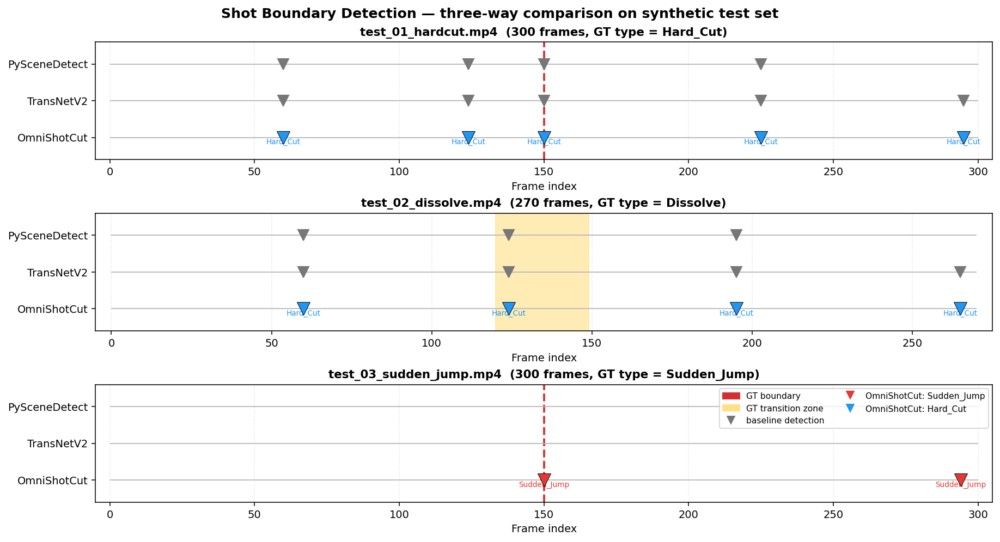

<p align="center">
    
</p>

# OmniShotCut — Three-Way SBD Comparison Demo on RTX 4090

> 这是 [UVA-Computer-Vision-Lab/OmniShotCut](https://github.com/UVA-Computer-Vision-Lab/OmniShotCut) 的 fork。
> 本分支 (`demo-three-way-eval`) 在本机 RTX 4090 上跑通 OmniShotCut，并与
> [TransNetV2](https://github.com/soCzech/TransNetV2)（kunato/transnetv2pt 移植版）和
> [PySceneDetect](https://github.com/Breakthrough/PySceneDetect) 做了**三方对比**，
> 重点验证论文 Table 1 里 OmniShotCut 在 **Sudden Jump（同源跳剪）** 场景下相对 baseline 的差异化能力。
>
> 完整中文文档见 **[`eval_runs/README.md`](eval_runs/README.md)**，详细帧级对比见 **[`eval_runs/COMPARISON.md`](eval_runs/COMPARISON.md)**。
> 原作者论文与项目介绍见本页 [Original Project](#original-project) 部分。

---

## 一图讲完三方差异



- **test_01 (硬切)**：三方都过得了
- **test_02 (1s xfade dissolve)**：三方都在转场起点附近有检出，但 OmniShotCut 把它标成了 `Hard_Cut`，没识别出 dissolve（**有意思的失效案例**）
- **test_03 (sudden jump)**：**PySceneDetect 和 TransNetV2 都 0 边界检出，唯一只有 OmniShotCut 在 frame 150 处准确标记 `Sudden_Jump`**

---

## 为什么做这个对比（思路）

### 1. 智能创作 pipeline 的真实痛点

视频生成模型（[NVIDIA Cosmos](https://github.com/nvidia-cosmos/cosmos-curate) /
[Open-Sora Plan](https://arxiv.org/abs/2412.00131) / Wan / CogVideoX）的训练数据 pipeline 第一步是
镜头边界检测（Shot Boundary Detection, SBD），把长视频拆成时序连贯的干净片段。
真正的痛点不在硬切（任何方法都能检），而在 **Sudden Jump**——
vlog 跳剪、直播录屏、无人机视频中断这种 *同一场景内的不连续*。

OmniShotCut 论文（[arXiv:2604.24762](https://arxiv.org/abs/2604.24762)）Table 1 给出的数据：

| 方法 | Sudden Jump 准确率 | Transition IoU |
|---|---|---|
| PySceneDetect | 0.416 | 0.183 |
| TransNetV2 | 0.261 | 0.192 |
| AutoShot | 0.455 | 0.252 |
| **OmniShotCut** | **0.761** | **0.632** |

### 2. 我做的对比设计

3 段程序化合成视频，**ground truth 帧号精确已知**（详见 [`test_videos/GROUND_TRUTH.md`](test_videos/GROUND_TRUTH.md)）：

| 文件 | 规格 | 关键边界 | GT 类型 | 设计意图 |
|---|---|---|---|---|
| `test_01_hardcut.mp4` | 640×360, 30fps, 10s | frame 150 | `Hard_Cut` | 基础对照，三方都该过 |
| `test_02_dissolve.mp4` | 640×360, 30fps, 9s | frame 120-149 | `Dissolve` | 渐变转场 IoU 精度 |
| `test_03_sudden_jump.mp4` | 540×720, 30fps, 10s | frame 150 | **`Sudden_Jump`** | **杀手锏**：同一段数字人长镜头抽 0-5s + 20-25s 拼接，模拟 vlog 跳剪 |

`test_03` 是关键场景：前后两段是同一个人、同一个机位、同一个背景，**只有动作位置突然错位**。
传统 SBD 模型（颜色直方图 / 3D CNN）对这种不连续基本瞎眼。

### 3. 三方对比结果

| 测试 | PySceneDetect 0.7 | TransNetV2 (transnetv2pt 1.0.0) | OmniShotCut (官方 ckpt) |
|---|---|---|---|
| test_01_hardcut | ✅ 检出 (含 frame 150) | ✅ 检出 (含 frame 150) | ✅ 检出 + **类型标 `Hard_Cut`** |
| test_02_dissolve | 🟡 frame 124 (无类型) | 🟡 frame 124 (无类型) | 🟡 frame 124/195，**类型错（标 Hard_Cut）** |
| **test_03_sudden_jump** | **❌ 1 scene, 0 边界** | **❌ 1 scene, 0 边界** | ✅✅ frame 150 + **类型标 `Sudden_Jump`** |

OmniShotCut 在 `test_03` 上的实际 JSON 输出：

```json
{
  "video_path": "test_videos/test_03_sudden_jump.mp4",
  "pred_ranges":      [[0, 150], [150, 294], [294, 300]],
  "pred_intra_labels":["General",  "General",     "General"],
  "pred_inter_labels":["New_Start","Sudden_Jump", "Sudden_Jump"]
}
```

frame 150 处不仅检出边界，还**正确分类为 `Sudden_Jump` 而不是 `Hard_Cut`**——
这是 OmniShotCut 跟另两家的根本差异：另两家只能告诉你"这里有边界"，
OmniShotCut 还告诉你"这是同源跳剪而不是场景切换"。

### 4. 关键观察（含局限）

1. **OmniShotCut 的差异化价值 = inter-shot 类型识别**，不只是检出边界——这是它进入下游视频生成数据 pipeline 的护城河。
2. **TransNetV2 本机实测比论文 Table 1 还更糟**：论文给 0.261，本机直接 1 scene 0 边界（全漏）。原因是 test_03 的同一数字人长镜头在颜色 / 纹理上几乎完全一致，frame-level logits 全部低于阈值 0.5。
3. **OmniShotCut 在 ffmpeg `xfade=dissolve` 上失效**：未识别为 `Dissolve`，标为 `Hard_Cut`。可能原因（论文 doc:497-504 自承）：训练数据用程序化合成的 dissolve 跟 ffmpeg 线性混合 dissolve 在像素层面分布有偏差。这是 SBD 领域的开放问题。
4. **OmniShotCut 对源视频内部本来的镜头切换也很敏感**：作者自带的 `__assets__/demo_video1/2.mp4` 各 60s 是混剪 demo（不是单镜头），test_01/02 上 OmniShotCut 检出 5-6 个 shot 而非 GT 的 2 个，这是模型能力，不是 bug。

---

## 怎么复现

### 环境

- Linux + RTX 4090 + CUDA 12.4
- conda env `OmniShotCut` (python 3.10, torch 2.5.1+cu124)
- 详见 [`LOCAL_NOTES.md`](LOCAL_NOTES.md)

### 安装

```bash
conda create -n OmniShotCut python=3.10
conda activate OmniShotCut
pip install torch==2.5.1 torchvision==0.20.1 torchaudio==2.5.1 \
  --index-url https://download.pytorch.org/whl/cu124
pip install -r requirements.txt
conda install -c conda-forge ffmpeg
pip install spaces socksio "scenedetect[opencv]"
pip install git+https://github.com/kunato/transnetv2pt.git

# 模型权重
mkdir checkpoints && cd checkpoints
wget https://huggingface.co/uva-cv-lab/OmniShotCut/resolve/main/OmniShotCut_ckpt.pth
```

### 跑全流程

```bash
# 1. OmniShotCut（每段视频依次跑）
./run.sh infer --input_video_path test_videos/test_01_hardcut.mp4    --mode default
./run.sh infer --input_video_path test_videos/test_02_dissolve.mp4   --mode default
./run.sh infer --input_video_path test_videos/test_03_sudden_jump.mp4 --mode default

# 2. PySceneDetect (三段)
for v in test_videos/test_*.mp4; do
  ./run.sh shell -m scenedetect -i "$v" detect-content list-scenes --no-output-file
done

# 3. TransNetV2 (三段一次跑完)
./run.sh shell eval_runs/run_transnetv2.py

# 4. 重新生成对比图
./run.sh shell eval_runs/plot_comparison.py
```

`run.sh` 的作用是 export `PYTHONNOUSERSITE=1` 并走 conda env 的绝对路径 python——
本机的 `~/.local/site-packages` 在 sys.path 优先级高于 conda env，不屏蔽就会加载到旧版包。

### 启动 Gradio demo（本地）

```bash
./run.sh app
# 浏览器打开 http://127.0.0.1:7860
```

注：原版 `app.py:357` 的 `demo.launch(share=True)` 会创建 gradio.live 公网隧道，
本 fork 已改为 `server_name="127.0.0.1", share=False`，避免内网穿透。

---

## 资产清单

```
.
├── README.md                       # ← 本文件
├── LOCAL_NOTES.md                  # 本机部署速查
├── run.sh                          # PYTHONNOUSERSITE=1 启动包装
├── app.py                          # Gradio demo（已改本地化）
├── test_videos/                    # 三段合成测试视频
│   ├── GROUND_TRUTH.md
│   ├── test_01_hardcut.mp4
│   ├── test_02_dissolve.mp4
│   └── test_03_sudden_jump.mp4
└── eval_runs/                      # 三方对比结果
    ├── README.md                   # 完整中文文档
    ├── COMPARISON.md               # 详细帧级对比与复现命令
    ├── comparison_timeline.png     # ⭐ 三方时间轴对比图
    ├── plot_comparison.py
    ├── run_transnetv2.py
    ├── test_01_hardcut/{results.json, viz/}
    ├── test_02_dissolve/{results.json, viz/}
    ├── test_03_sudden_jump/{results.json, viz/}    # ⭐ 核心证据
    └── baseline_transnetv2/results.json
```

---

<a id="original-project"></a>

## Original Project

> 以下是原 [UVA-Computer-Vision-Lab/OmniShotCut](https://github.com/UVA-Computer-Vision-Lab/OmniShotCut) 项目介绍，归属作者。

### OmniShotCut: Holistic Relational Shot Boundary Detection with Shot-Query Transformer

OmniShotCut is a sensitive and more informative SoTA for Shot Boundary Detection.
It detects shot changes across diverse sources (anime, vlog, game, shorts, sports, screen recording, etc.)
and recognizes Sudden Jumps and transitions (dissolve, fade, wipe, etc.) by proposing a
Shot-Query-based Video Transformer.

[](https://arxiv.org/abs/2604.24762)
[](https://uva-computer-vision-lab.github.io/OmniShotCut_website/)
[](https://huggingface.co/spaces/uva-cv-lab/OmniShotCut)
[](https://huggingface.co/uva-cv-lab/OmniShotCut)

<p align="center">
    
</p>

<p align="center">
    
</p>

### Citation

```bibtex
@article{wang2026omnishotcut,
  title={OmniShotCut: Holistic Relational Shot Boundary Detection with Shot-Query Transformer},
  author={Wang, Boyang and Xu, Guangyi and Tang, Zhipeng and Zhang, Jiahui and Cheng, Zezhou},
  journal={arXiv preprint arXiv:2604.24762},
  year={2026}
}
```

---

## License & Attribution

本 fork 仅在原项目基础上添加了对比 demo（`eval_runs/`、`test_videos/`、`run.sh`、`LOCAL_NOTES.md`）
和本地化的 `app.py`，不修改 OmniShotCut 模型本身。原项目代码与权重的版权归
[UVA Computer Vision Lab](https://uva-computer-vision-lab.github.io/) 与论文作者所有。
